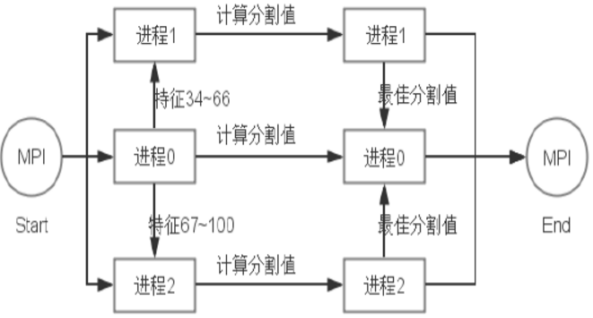

### 基于GBDT的机器学习

### 算法原理
#### 算法总述
- GBDT是boosting算法的一种——将多个弱学习器，通过加法模型，组合成一个强学习器。对于GBDT而言，其弱分类器就是决策树，采用的代价函数就是参差，其核心思想是，通过不断地增加决策树的数量，来使得参**差逐**渐缩小直至为0（实际上达到0的概率很低）。在预测的时候，则通过累加每棵决策树的预测结果，得到的最终结果即为预测值
- 需要注意的是，对于GBDT而言，它的每一棵决策树，都是回归树，而非分类树，因为只用回归树的累加结果才有意义。同时，每棵决策树的叶子节点都是人为固定的。在我的代码中，为了便于实现，还限定了每棵决策树均为完全二叉树。若最中预测的是一个类别，而非一个连续值，则可以设定一个阈值，通过比较阈值与最终预测值的大小，从而再决定是哪个类别
- 决策树包含分类树和回归树

#### GBDT算法流程
1. 初始化：
    - 矩阵 $samples=\sum_{i=0}^N\sum_{j=0}^Mvalue_{ij}$，其中 $value_{ij}$ 表示第 $i$ 个样本的第 $j$ 个特征所对应的特征值
    - 数组 $lists=\sum_{i=0}^Ngoal_i$，其中 $goal_i$ 表示第 $i$ 个样本所对应的类别或者一个值
    - 参差 $errs=list$
    - 估计值 $F(x)=0$，其中 $x$ 为每一个样本。该式表示将所有样本的估计值初始化为 $0$
2. 开始训练：
训练过程如下
```python
'''
算法思路：通过迭代，不断降低参差errs，理想情况下将errs下降至0
'''
dtrees = []
# 初始化当前所有样本的估计值
for x in samples:
    F[x] = 0
# 建第 i 棵决策树
For i: 0 -> n
    # 根据当前所有样本的估计值来更新残差
    updateErrs(samples, tree, errs, F)
    # 找到当前最优决策树
    tree = findBestTree(samples, lists)
    # 将当前最优决策树加入树集合中
    dtrees.append(tree)
    # 根据找到的当前最优决策树，来对所有样本的估计值F进行更新
    updateF(tree, samples, F)
```
那么应该要如何找到最优决策树？其方法如下：
```python
def findBestTree(samples, lists):
    # 对每个特征
    for feature in Features:
        '''
        根据当前特征的所有特征值，采用‘最小方差’找出当前特征下的最优回归树
        '''
    '''
    比较各个特征对应的‘最小方差’，即‘局部最小方差’，从中找出全局最小方差，
    则该全局最小方差对应的回归树树就是我们要找的最优决策树
    '''
```
注意，在找最优决策树时，寻找的标准不仅仅有‘最小方差’，还有其它方法，只不过在回归树中，‘最小方差’是最常用的方法<br />
那么要如何更新残差？残差其实就是真实值和预测值之间的差值。更新方法如下：
```python
def updateErrs(samples, tree, errs, F):
    # 对每个样本
    for samples[index] in samples:
        '''[1] 通过tree来计算当前样本 samples[index] 的预测值F[index]'''
        '''[2] 更新残差 errs[index] -= F[index]'''
```
更新当前所有样本的估计值，这其实是一个累加的过程，做法如下：
```python
def updateF(tree, samples, F):
    # 遍历所有样本
    for x in samples:
        '''F[x]表示当前样本x的估计值'''
        '''tree(x)表示当前决策树对样本x的预测值'''
        F[x] += tree(x)
```
### 数学推导
- 残差计算：$$ Var(\{Y_1,\dots,Y_l\})=\sum_{j=1}^l\frac{Y_j}{Y}Var(Y_j)=\sum_{j=1}^l\frac{|Y_j|}{|Y|}\left(\frac{1}{|Y_j|}\sum_{y\in Y_j}y^2-\arg^2y_j\right) $$
$$ =\frac{1}{|Y|}\sum_{y\in Y}y^2-\sum_{j=1}^l\frac{|Y_j|}{Y}\arg^2y_j $$

其中
$$ Var(Y_j)=\frac{1}{|Y_j|}\sum_{y\in _j}\left(y-\arg y_j\right)^2=\frac{1}{|Y_j|}\sum_{y\in Y_j}y^2-2\arg y_j\sum_{y\in Y_j}y+\sum_{y\in Y_j}\arg^2{y_j}$$
$$=\frac{1}{|Y_j|}\left(\frac{1}{|Y_j|}\sum_{y\in Y_j}y^2-2\arg y_j|Y_j|\arg y_j+|X|\arg^2y_j\right) $$
$$ =\frac{1}{|Y_j|}\sum_{y\in Y_j}y^2-\arg^2y_j $$

其中 $ \arg y_j=\frac{1}{|Y_j|}\sum_{y\in Y_j}y $

### 损失函数
GBDT可以使用多种损失函数，如平方损失、绝对指损失、对数损失等。如下：

1. 0-1损失函数：
$$
L(Y,f(X))=
\begin{cases}
1, & \text{$Y \neq f(X)$} \\
0, & \text{$Y = f(X)$}
\end{cases}
$$
2. 平方损失函数：
$$
L(Y,f(X))=(Y-f(X))^2
$$
3. 绝对值损失函数：
$$
L(Y,f(X))=\left|Y-f(X)\right|
$$
4. 对数损失函数/对数似然损失函数：
$$
L(Y,P(Y|X))=-\log P(Y|X)
$$

本次实验中，我采用的损失函数是“平方损失函数”

### 并行化思路
在每次迭代建树中，最耗费时间的地方，有两处，分别是：

1. 计算选取最优分割特征值
2. 特征值的排序

对于（1），可以通过采用多进程计算的方法，具体做法如下：<br />
在选取最优分割特征时，由于每个特征值计算最佳分割值是相互独立的，所以可以将特征集划分为互斥的多份，每份子集特征的计算则交由多个子进程分别负责，最后比较各个子进程计算的最优特征分割值，从中选取出全局最优分割值。这样使得特征的计算“并行化”，加快寻找最优分割特征值的速度。在本次实验中，我的并行化就采用的这种思路。过程图如下：
<center>

</center>
对于（2），可以在数据预处理中，事先先对各个特征值进行排序且去重，并分别以“块”的形式进行存储，这样，就能避免在后面的选取最优特征分割时反复进行特征值排序，从而加快。而在对各个特征值进行事先排序时，也能采用类似上面的多进程方法，加快排序速度。其实这并不属于并行化范围，而是数据预处理范畴。由于该实现较为复杂，以及一些细节尚未想通，所有该方法在本实验中并未实现。

### 数据处理注意
- 在寻找最优决策树时，如果要计算的特征值过多，则可以通过随机采样其中若干个来计算，这样能加快运算速度。我是每次随机抽取1000个特征值进行计算

### 实验问题记录
1. 在进行并行化时，我采用的思路时，利用多进程来并行计算最优特征分割点。然而，由于在python的多进程中，参数的传递的方式是深拷贝，而特征矩阵非常大，所有这就造成了多进程的计算速度反而比单进程的慢！于是我采用了共享内存的方式，将特征矩阵存入共享内存中。在python中，共享内存有两种方式，分别是’Manager‘和’sharetypes‘的方式，前者其实依旧是采用深拷贝的方式，而后者才是我所需的浅拷贝。在使用’sharetypes‘实现共享内存后，多进程的优势就体现出来了，计算最优特征分割点的速度明显得到提升。下面简短举个例子记录下如何使用这种方式：
```python
from multiprocessing import Pool
from multiprocessing import sharetypes as sct
import numpy as np
import ctyps

# 进程池初始化时调用函数
def init(matrix_):
    # 设置共享变量
    global matrix
    matrix = matrix_

# 创建共享变量
sh = sct.RawArray(ctyps.c_float, np.random.randn(5))
# 创建进程池
pool = Pool(processes = 4, initializer = init, initargs = (sh, ))

# 测试函数
def test(*args):
    '''这里就可以直接使用共享变量matrix'''

# 从进程池中分配一个进程用于调用test函数
pool.apply.async(test, (...))
```

### 目录说明
```
.
├── data
│   ├── sample_submission.txt 
│   ├── test_data.txt ----------------- 测试样本数据集
│   └── train_data.txt ---------------- 训练样本数据集
├── output ---------------------------- 输出结果
│   ├── gbdt_result.json -------------- gbdt模型
│   ├── test_result.txt --------------- 测试结果
|   ├── parallel_gbdt_result.json ----- 并行化gbdt模型
│   └── parallel_test_result.txt ------ 并行化测试结果
├── src ------------------------------- 源文件
│   ├── config.py
│   ├── dtree.py
│   ├── gbdt.py
│   ├── globalVar.py
│   ├── run.py ------------------------ 入口文件
│   └── utils.py
└── src-parallel ---------------------- 并行化源文件
    ├── ......
```

### 环境说明
- 环境：ubuntu
- 语言：python3.5以上
- 第三方模块：numpy

### 链接
- 训练测试数据集下载：[https://pan.baidu.com/s/1dFGeSgx](https://pan.baidu.com/s/1dFGeSgx)
- 参考链接：[http://www.cnblogs.com/pinard/p/6140514.html](http://www.cnblogs.com/pinard/p/6140514.html) <br />
&nbsp;&nbsp;&nbsp;&nbsp;&nbsp;&nbsp;&nbsp;&nbsp;&nbsp;&nbsp;&nbsp;&nbsp;&nbsp;&nbsp;&nbsp;&nbsp;&nbsp;&nbsp;[http://blog.csdn.net/a819825294/article/details/51188740](http://blog.csdn.net/a819825294/article/details/51188740)