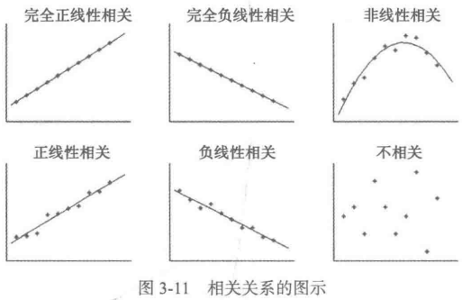
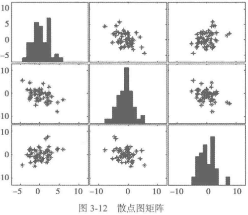
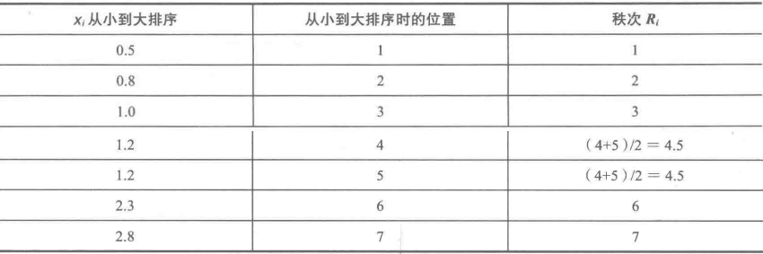

* [3.1 数据质量分析](#31-数据质量分析)
    * [3.1.2 缺失值分析](#312-缺失值分析)
    * [3.1.2 异常值分析](#312-异常值分析)
    * [3.1.3 一致性分析](#313-一致性分析)
* [3.2 数据特征分析](#32-数据特征分析)
    * [3.2.1 分布分析](#321-分布分析)
       * [定量数据分析](#定量数据分析)
       * [定性分类数据分析](#定性分类数据分析)
    * [3.2.2 对比分析](#322-对比分析)
    * [3.2.3 统计量分析](#323-统计量分析)
    * [3.2.4 周期性分析](#324-周期性分析)
    * [3.2.5 贡献度分析](#325-贡献度分析)
    * [3.2.6 相关性分析](#326-相关性分析)
* [3.3 Python主要数据探索函数](#33-python主要数据探索函数)
    * [3.3.1 基本统计函数](#331-基本统计函数)
    * [3.3.2 拓展统计特征函数](#332-拓展统计特征函数)
    * [3.3.3 统计作图函数](#333-统计作图函数)

## chapter3
### 3.1 数据质量分析
#### 3.1.1 缺失值分析
1. 分析方法：简单的统计分析
2. 处理方法：
    - 删除缺失值记录
    - 插补
    - 不处理

#### 3.1.2 异常值分析
1. 分析方法：
    - 简单统计量分析：常用最大最小值看数据是否超出合理范围
    - $3\sigma$ 原则：若数据服从正态分布，则异常值即为与平均值的**差值**超过3倍标准差的值
    - 箱线图分析：异常值为小于 $Q_L-1.5IQR$ 或大于 $Q_U+1.5IQR$ 的值，其中 $Q_L$ 为下四分位数，$Q_U$ 为上四分位数，$IQR$ 为四分位数间距，即 $IQR=Q_U-Q_L$（[样例代码](code/boxplot.py)）

#### 3.1.3 一致性分析
1. 不一致性是指同一条记录，但存在若干个特征值不相同的情况

### 3.2 数据特征分析
#### 3.2.1 分布分析
1. 目的：揭示数据的分布特征和分布类型
    - 定量数据：频率分布表、频率分布直方图、茎叶图——了解分布是否对称以及是否存在特大或特小的可疑值
    - 定性分类数据：饼图、条形图——直观显示分布情况
    
##### 定量数据分析
1. 处理过程
    1. 求极差（max-min）
    2. 决定组距和组数
    3. 决定分点（即每组用一个值表示，一般取该组的中点）
    4. 列出频率分布表
    5. 绘制频率分布直方图
2. 注意事项
    - 各组互斥
    - 各组必须将所有数据包含在内
    - 组宽最好相等
    
##### 定性分类数据分析
1. 根据分类类型进行分组，采用饼图和条形图来描述变量的分布

#### 3.2.2 对比分析
1. 定义：将两个相互联系的**指标**进行比较
2. 目的：从数量上展示说明研究对象规模的大小、水平的高低、速度的快慢，以及各种关系是否协调，从而做出客观的评价
3. 采用形式
    - 绝对值比较：通常用于寻找差异
    - 相对数比较：反映客观现象之间数量联系程度
        - 结构相对数：同一总体的部分数值与该总体的全部数值对比求比重，如居民食品支出额帮消费支出总额比重、产品合格率
        - 比例相对数：将同一总体内不同部分的数值进行对比，表明各部分的比例关系
        - 比较相对数：将同一时期两个性质相同的指标数值进行对比，如不同地区商品价格对比
        - 强度相对数：将两个性质不同但有一定联系的总量指标进行对比，如“元/人”
        - 计划完成程度相对数
        - 动态相对数：同一现象在不同时期的指标数值进行对比

#### 3.2.3 统计量分析
1. 用统计指标对**定量数据**进行统计描述，统计指标通常分**集中趋势**和**离中趋势**两种
2. 统计指标
    1. 集中趋势：
        - 均值：用于反映数据的集中程度。缺点是对极端值很敏感，可通过采用截断均值（即去掉最高最低端值后的平均数）来消除少数极端值的影响
        - 中位数
        - 众数：适用于离散型变量
    2. 离中趋势：
        - 极差：极大值-极小值
        - 标准差
        - 变异系数：用于度量标准差相对于均值的离中趋势，计算公式为：$CV=\frac{s}{arg(x)}×100\%$，变异系数越小，说明数据越集中。它主要用于比较两个或多个具有不同单位或不同波动幅度的数据集的离中程度
        - 四分位数间距：即上四分位数与下四分位数之差，该值越大说明数据变异程度越大
3. [示例代码](code/statistics_analyze.py)

#### 3.2.4 周期性分析
1. 目的：探索某个变量是否岁时间变化而呈现某种周期变化趋势

#### 3.2.5 贡献度分析
1. 又称帕累托分析，基于帕累托法则，或称20/80定律（二八定律）进行分析统计
2. 目标：用20%的投入换取80%的产出
3. [示例代码](code/dish_pareto.py)
4. 代码运行结果：

#### 3.2.6 相关性分析
1. 定义：分析**连续变量**之间线性相关程度的强弱，并用适当的统计指标表示出来的过程
2. 散点图和散点图矩阵
    - 散点图：两变量之间的关系
    - 散点图矩阵：多变量之间的关系
3. 相关系数：描述变量之间的线性相关程度
    - **两变量**之间:
        - Pearson 相关系数：必须是**连续变量**，且连续变量的取值服从**正态分布**
        $$
            r=\frac{\sum_{i=1}^n(x_i-\arg{x})(y_i-\arg{y})}{\sqrt{\sum_{i=1}^n(x_i-\arg{x})^2\sum_{i=1}^n(y_i-\arg{y})^2}}
        $$
        其取值范围为:$-1\leq r \leq 1$，其中
        $$
            \begin{matrix}
            r>0为正相关，r<0为负相关 \\
            |r|=0表示不存在线性关系 \\
            0<|r|<1为表示完全线性相关
            \end{matrix}
        $$
        $0<|x|<1$表示存在不同程度线性相关，其中
        $$
            \begin{matrix}
            |r|\leq0.3为不存在线性相关 \\
            0.3<|r|\leq0.5为低度线性相关 \\
            0.5<|r|\leq0.8为显著线性相关 \\
            |r|>0.8为高度线性相关
            \end{matrix}
        $$
        - Spearman 秩相关系数：又称等级相关系数，可用于**不服从正态分布变量、分类或者等级变量**之间的关联性分析
        $$
            r_s=1-\frac{6\sum_{i=1}^n(R_i-Q_i)^2}{n(n^2-1)}
        $$
        对两个变量分别按照从小到大的顺序成对的取值并编秩，$R_i$表示$x_i$的秩次，$Q_i$表示$y_i$的秩次，$R_i-Q_i$为$x_i,y_i$的秩次之差。下面为具体例子
        **只要两个变量具有严格单调的函数关系，则为完全Spearman相关的**（*研究表明，在正态分布下，Spearman和Pearson在效率上是等价的，而对于连续测量数据，则更适合用Pearson*）
        - 判定系数：为**相关系数**（上述两种中任意一种）的平方，记为$r^2$，取值范围为$[0,1]$。$r^2$越接近1，表明$x$和$y$之间的相关性越强，反之则越弱，几乎没有直线线性相关性
4. [样例代码](code/correlation_analyze.py)

### 3.3 Python主要数据探索函数
1. Pandas用于数据分析，Matplotlib用于数据可视化

#### 3.3.1 基本统计函数
| 函数名 | 函数功能 | 使用方式| 所属库 |
| :----: | :----: | :----: | :----: |
| sum() | **按列**计算数据样本的总和 | DataFram/Series.sum() | Pandas |
| mean() | 样本的算数平均值 | DataFram/Series.mean() | Pandas |
| var() | 样本方差 | DataFram/Series.var() | Pandas |
| std() | 标准差 | DataFram/Series.std() | Pandas |
| corr() | Spearman(Pearson)相关系数矩阵 | DataFram.corr(method='pearson')（参数支持pearson(皮卡森相关系数，默认选项)、kendall(肯德尔系数)、spearman(斯皮卡尔曼系数)）| Pandas |
| cov() | 样本协方差矩阵 | DataFram.cov() or Series.cov(Secies)（计算两个Series之间的协方差） | Pandas |
| skew()/kurt() | 样本值的偏度（三阶矩/四阶度）| DataFram/Series.skew()/kurt() | Pandas |
| describe() | 样本的基本描述（均值、标准差、四分位等）| DataFram/Series.describe() | Pandas |

#### 3.3.2 拓展统计特征函数
| 函数名 | 函数功能 | 使用方式| 所属库 |
| :----: | :----: | :----: | :----: |
| cummax() | 依次给出前 $1、2、\dots、n$ 个数的最大值 | DataFram/Series.cummax() | Pandas |
| cummin() | ... | DataFram/Series.cummin() | Pandas |
| rolling_sum() | **按列**计算样本总和 | pd.rolling_sum(DataFram/Series, k)，每k列依次计算一次和 | Pandas |
| rolling_mean() | **按列**计算样本算数平均数 | pd.rolling_mean(DataFram/Series, k)，每k列计算依次均值 | Pandas |
| rolling_var() | ... | ... | ... |
| rolling_std() | ... | ... | ... |
| rolling_corr() | ... | ... | ... |
| rolling_cov() | ... | ... | ... |
| rolling_skew() | ... | ... | ... |
| rolling_kurt() | ... | ... | ... |

#### 3.3.3 统计作图函数
| 作图函数名 | 作图函数功能 | 所属工具箱 |
| :----: | :----: | :----: |
| plot() | 线性二维图，折线图 | Matplotlib/Pandas |
| pie() | 饼行图 | Matplotlib/Pandas |
| hist() | 二维条形直方图 | Matplotlib/Pandas |
| boxplot() | 箱形图 | Matplotlib/Pandas |
| plot(logy=True) | y轴的对数图形 | Pandas |
| plot(yerr=error) | 误差条形图 | Pandas |