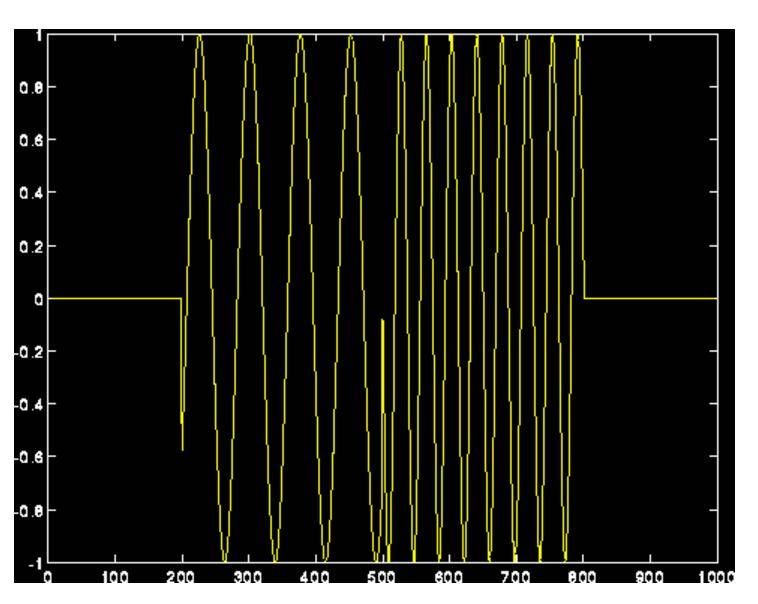
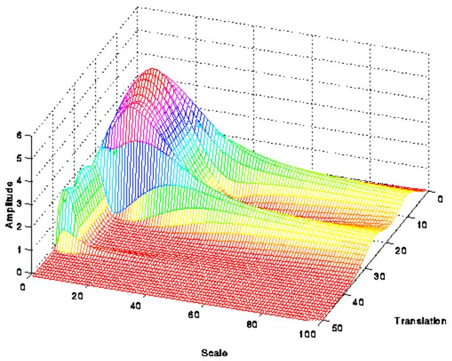

# 小波变换

- 参考链接：[http://blog.jobbole.com/101976/](http://blog.jobbole.com/101976/)
- 时域信号 $\rightarrow$ 时-频信号
    + 时域信号：信号是关于时间的函数，显示信号随时间改变的变换关系
    + 时-频信号：显示频谱分量及其时间定位
    + 图形由三维组成：时间、尺度（频率的倒数）、幅值
- 特点：
    + 同时提供时间和频率信息，给出了信号的一种时频表示
    + 适用于非平稳信号
- 样例图：

<figure style="display: inline-block">
    
    <figcaption>时域信号</figcaption>
</figure>
<figure style="display: inline-block">
    
    <figcaption>小波变换</figcaption>
</figure>

其中小波变换图 $Z-幅值$，$X-尺度$，$Y-时间$
- 高频信号在时域内很好分辨，低频信号则在频域内容易分辨

### 变换过程：
设想我们有一个信号，其中频率最高的分量为1000Hz。第一步，我们通过高通和低通滤波器把信号分成两个信号（滤波器必须满足某些特定的条件，即容许条件），结果得到了同一信号的两个部分，0-500Hz的部分（低通部分）和500-1000Hz的部分（高通部分）。

然后，我们可以拿其中一部分（通常是低通部分）或者二部分，然后对每一部分继续进行相同的操作。这个过程叫做分解。

假设我们拿低频部分做了处理，现在我们就有了3组数据，分别为信号在0-250Hz，250-500Hz和500-1000Hz的部分。

然后再对低通部分的信号继续做高通和低通滤波处理；现在我们就有了4组数据，分别为0-125Hz，125-250Hz，250-500Hz和500-1000Hz。我们持续进行这个过程，直到将信号分解到一个预先定义的水平。这样我们就有了一系列信号，这些信号实际上都来自相同的信号，但是每一个都对应不同的频带。我们知道每个信号对应的频段，如果我们将这些信号放在一起画出三维图，一个轴表示时间，频率在另外一个轴上，幅度在第三个轴上。这幅图会告诉我们各个频率出现哪些时刻（这里有一个问题，叫做“不确定性原理”，即我们不能精确地知道哪个频率出现在哪些时间点，我们仅能知道某一频段出现在哪一时间区间内）。